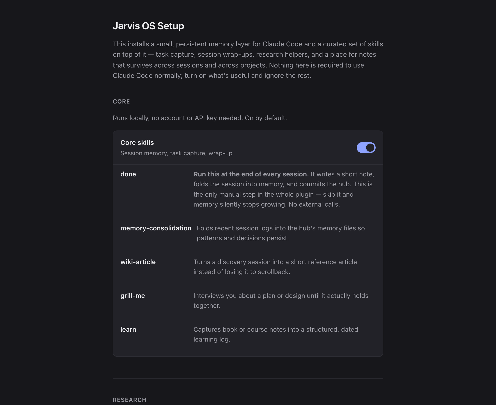

<p align="center">
  
</p>

<h1 align="center">Jarvis OS</h1>

<p align="center">
  <b>Claude Code forgets you between conversations. This fixes that.</b><br>
  A memory that follows you into any project, plus skills that keep it up to date on their own.
</p>

<p align="center">
  <a href="LICENSE"></a>
  
  
  
  <a href="https://github.com/ManceRayder42/jarvis-os/stargazers"></a>
</p>

## Quick start

Three steps. No account, no API key, nothing to pay for.

**1. Install it.** In Claude Code, run:

```bash
claude plugin marketplace add ManceRayder42/jarvis-os
claude plugin install jarvis-os
```

(A "plugin" here just means an add-on for Claude Code. These two commands
tell it where to find this one and to install it — you only do this once.)

**2. Restart Claude Code**, then type:

```
/jarvis-setup
```

**3. A page opens in your browser.** Pick where you'd like your memory kept
(or just leave the default) and press the button. The page does everything
else itself: it creates the memory folder, keeps a history of changes to it,
turns on the default set of skills, and — if you have the note-taking app
Obsidian installed — connects to it automatically. There is nothing else to
set up.

<p align="center">
  
</p>

You're done. Everything from here on happens on its own.

## What you actually get

Claude Code normally starts every conversation from nothing — it doesn't
remember what you told it yesterday, or in a different project folder. This
plugin gives it a **memory** (technically a "hub": just one folder on your
computer, created for you in step 3 above, that Claude reads at the start of
every conversation no matter which project you're in).

On top of that memory, it adds a set of **skills** — extra abilities Claude
picks up automatically when they're relevant. A few examples: closing out a
work session properly so nothing is forgotten, researching a topic with
citations, or turning a long explanation into a simple visual page instead of
a wall of text. The full list is further down.

## The one thing you have to remember

**Say "done" (or type `/done`) when you finish working.**

That's the only habit this asks of you. Everything else — memory loading,
skills firing, setup — happens automatically. Saying "done" tells Claude to
write down what happened and fold it into your memory's history, so your
*next* conversation actually knows about it.

Skip it, and nothing breaks — but nothing new gets remembered either, and you
won't see an error telling you so. That invisible failure is exactly why it's
worth turning into a habit. **If you take one thing from this page, take
this one.**

## What this is not

- **Not a copy of one person's personal setup.** Nothing here is tied to
  someone else's projects or preferences — you fill in your own memory as you
  use it.
- **Not a replacement for Claude Code's own project memory.** That's a
  different, narrower feature; the two work fine side by side.
- **Not going to tell you how to work.** A couple of routing/workflow
  defaults ship with a stated reason, never as "the one correct way."

---

## Beyond the basics

Everything past this line is for people who want to know how it works
underneath, or who want more than "memory that persists" — an always-on
assistant reachable from your phone, the exact skill list, or the license
paper trail. None of it is required reading to use the plugin day to day.

### How the memory actually works

Claude Code already has a memory feature — but it's tied to **git** (the
version-control system many coding projects use) and specifically to a
project's **repository** ("repo" — the folder Git is tracking). If your
current folder isn't one Claude Code recognizes, that memory silently doesn't
load. No error, no warning — the context you expected just isn't there, and
you don't find out until you've explained the same thing for the fourth time.

Jarvis OS sidesteps that: **one hub folder, one `MEMORY.md` file, injected
into every conversation's starting context regardless of where you launched
from.** A small startup script does this in milliseconds and silently does
nothing on any error — a memory feature that breaks your session start would
be worse than no memory feature.

**Obsidian is recommended, not required.** Obsidian is a popular
note-taking app; if you have it, the setup page links your memory folder into
it automatically so you can browse and cross-link your notes visually.
Everything works fine with a plain folder of text files if you don't.

### Setup, in more detail

`/jarvis-setup` opens a short-lived local web page (only reachable from your
own computer, protected by a one-time code in its link) where you pick a
memory folder (default `~/jarvis-hub`), turn skill groups on or off
individually, and optionally point at an Obsidian vault (Obsidian's word for
one of its note collections).

**By default, nothing runs in the background — no "daemon"** (a program that
keeps running invisibly after you close the window). The setup page itself
closes automatically: it exits when you close its browser tab, or after 10
minutes regardless, and it dies the moment the terminal that opened it does.
There's nothing to remember to shut down.

The **one** exception is something you turn on yourself, on purpose: the
[phone assistant](#phone-assistant-telegram-bridge) below, or the optional
[memory-consolidation scheduler](skills/memory-consolidation/references/scheduling.md).
Both of those genuinely do keep running in the background — that's the whole
point of them — and both come with the exact one-line command that removes
them again.

Until you run setup at all, the plugin stays quiet: one line at the start of
a conversation saying it isn't configured yet, nothing more.

### The full skill list

| | |
|---|---|
| **Memory that persists** | One hub folder, loaded into every conversation from anywhere on disk |
| **`/done`** | Closes a session: writes a note, folds it into memory, saves the change |
| **`/grill-me`** | Interviews you about a plan until it actually holds together |
| **`wiki-article`** | Turns a discovery session into a reference article instead of scrollback |
| **`learn`** | Book and course notes into a structured, dated learning log |
| **`eli5`** | Explains a concept or codebase as a simple visual page instead of a wall of text |
| **`defuddle`** | Any web page → clean, readable text, locally |
| **`qmd`** | Search across your own notes by keyword and by meaning |
| **`research-notebook`** | Multi-source research with citations, via NotebookLM |
| **`memory-consolidation`** | Folds recent session logs into memory so patterns persist |
| **`media-gen`** | Image/video generation via fal.ai — **off by default**, needs your own key |

The eleven above load by default. Six more ship **optional, off by
default** — see [Optional skills](#optional-skills) for what they are and why
they're not part of the default set:

| | |
|---|---|
| **`playwright-cli`** | Automated screenshots and error-checking for a website you're building |
| **`obsidian-markdown`** | Wikilinks, embeds, callouts, and note properties |
| **`obsidian-bases`** | `.base` files — table/card/list views over your notes |
| **`json-canvas`** | `.canvas` files — mind maps and flowcharts |
| **`obsidian-cli`** | Command-line control of a running Obsidian vault |
| **`voice`** | Turn a voice message into text, or a reply into speech, via ElevenLabs — **off by default**, needs your own key |

Skills that run locally and need no account load by default. Anything that
costs money, needs a large first-run download, or is only useful with
software you may not have ships turned off. A free plugin shouldn't ask for a
credit card — or a hundred-megabyte download — in the first five minutes.

### Optional skills

`playwright-cli`, `obsidian-markdown`, `obsidian-bases`, `json-canvas`,
`obsidian-cli`, and `voice` live in a separate `optional-skills/` folder
rather than the `skills/` folder every other skill loads from. That's
deliberate, not an oversight: Claude Code loads *everything* under a
plugin's `skills/` folder, so a simple on/off setting can't hide one of
them — it would just be another setting that looks like it does something
but doesn't (a real bug an earlier version of this plugin's Obsidian setting
had). Instead, enabling one of these six actually **moves it** into
`skills/` (technically: creates a link there, called a "symlink," pointing
back to the original — same effect as a real copy, without needing two of
everything), so Claude Code only ever sees it once it's genuinely turned on.

**Why these six are optional, not default:**
- `playwright-cli` — no licensing issue; its first run downloads real browser
  software (tens of megabytes), the same "not in the first minute" bar
  `media-gen` is held to.
- `voice` — needs your own ElevenLabs key, same reasoning as `media-gen`.
- `obsidian-markdown` / `obsidian-bases` / `json-canvas` / `obsidian-cli` —
  useless, and just clutter in your skill list, if you don't use Obsidian.
  Detected automatically (the app is installed, or you gave setup a vault
  path); if neither is true, the setup page points you at
  [obsidian.md/download](https://obsidian.md/download) (macOS one-liner:
  `brew install --cask obsidian`) instead of silently doing nothing.

**Terminal command**, for anyone who'd rather not use the setup page:

```bash
node setup/skills-materializer.mjs enable obsidian       # all four Obsidian skills
node setup/skills-materializer.mjs enable playwright-cli voice
node setup/skills-materializer.mjs status                # what's currently on
node setup/skills-materializer.mjs disable obsidian playwright-cli voice
```

Run these from the plugin's installed folder (`echo $CLAUDE_PLUGIN_ROOT` from
a live Claude Code conversation prints it). Re-run `enable` after a
`claude plugin update` — an update replaces the plugin's files from scratch,
which undoes anything switched on at runtime, the same way it would undo any
other local edit to an installed plugin.

### Phone assistant (Telegram bridge)

Everything in this section is for people who want an always-on assistant
reachable from their phone over Telegram — not something most people need on
day one, and it assumes you're comfortable working in a terminal.

The default way to reach Claude Code from your phone is its own **Remote
Control** feature (`claude remote-control` + claude.ai/code on your phone) —
no bot account, no allowlist, nothing to configure. Verified against the
shipped app (2.1.245), not just the docs, so here's exactly where it stops:

- Unavailable inside a cloud session and behind an enterprise gateway.
- Files the agent sends do **not** reach phone/web viewers.
- Only the effort level and one other setting are changeable from the remote
  side.
- Needs the host computer awake with a live conversation already running —
  it's remote control of a running session, not a standalone assistant.

For more than that — a persistent assistant you can message from Telegram
any time, that survives a reboot and restarts itself — this plugin ships
`bridge/`: a background session (kept running via `tmux`, a terminal
multiplexer) plus a watchdog that keeps it both alive and *reachable* (not
the same thing — see below). **Opt-in, and not installed by anything
automatically.** Full install/uninstall instructions and every tunable:
[`bridge/README.md`](bridge/README.md).

What you get once it's installed:

- `/new` — wrap the session up to memory and start fresh
- `/model <opus|sonnet|fable|id>`, `/effort <low|medium|high>` — switch mid-conversation
- `/compact [note]`, `/context` — manage the context window from your phone
- `/info` — model, effort, mode, uptime

**Reserved Telegram commands.** `/start`, `/help` and `/status` are
intercepted by Telegram's own connection ("channel," in Claude Code's
terms) and never reach the assistant — that's why the bridge's own status
command is `/info`, not `/status`. Don't expect those three to do anything
bridge-specific.

**The one sharp edge, stated plainly:** Telegram only allows **one** program
at a time to check for a bot's new messages. If you (or an old session you
forgot about, or a second computer) ever run **two** Claude Code sessions
connected to the same Telegram bot, Telegram silently cuts one of them off.
The loser keeps running and looks completely healthy — it's just **deaf**,
and every message that arrives while it's deaf is swallowed by the winner and
gone for good, not delayed. This is exactly the failure mode
`telegram-watchdog.sh` exists to detect and recover from (it tells you the
exact time window you were deaf, so you know what to resend) — but the safest
fix is structural: never turn on Telegram any other way, only ever start it
through `bridge/telegram-bridge.sh`. Read
[`bridge/README.md`](bridge/README.md) and `SECURITY.md` before installing
this piece.

### Skills and licenses

Every shipped skill was checked against its **primary source** license
before inclusion — not a blog post about the license, the actual license
file.

- **Vendored as-is (MIT):** `defuddle`, `obsidian-markdown`, `obsidian-bases`,
  `json-canvas`, and `obsidian-cli` (Steph Ango / kepano, all from the same
  `kepano/obsidian-skills` source, current upstream at time of vendoring),
  and `qmd` (Tobi Lütke). The bundled `qmd` is **not current upstream** — a
  trimmed fork of v2.0.0, while `github.com/tobi/qmd` is at v2.2.0 and has
  since added a few extra features. Treat it as a known-older excerpt. The
  four Obsidian skills are optional — see [Optional skills](#optional-skills).
- **Ported and rewritten to remove anything personal**, from one person's own
  workflow skills: `done`, `memory-consolidation`, `wiki-article`, `learn`,
  `research-notebook`, `media-gen`, `playwright-cli`, `voice` (the last two
  also optional — see above).
- **Already generic, ships as-is:** `grill-me`, `eli5` (original instructions;
  credits the underlying technique to Thariq at Anthropic via a public
  write-up — see the file itself).

Evaluated and deliberately **left out**: `scroll-world` (a scroll-cinematic
video skill) has no license file traceable to any real upstream source or
author — its LICENSE file names a copyright holder with no linked project or
profile anywhere, so there's nothing to verify against. A skill this repo
can't point at a primary source for doesn't ship, no matter how good it is.

### Recommended, but install them yourself

Left out for license reasons, not quality ones:

- **`llm-council`** — a question or decision run past five independent
  advisors, peer-reviewed, then synthesized. By
  [Ole Lehmann](https://github.com/aiwithremy/claude-skills-llm-council),
  methodology credited to Andrej Karpathy. Its repo ships **no LICENSE file**,
  so there's no grant to redistribute it.
- **`nano-banana`** — image generation and editing, with a free tier. Licensed
  **AGPL-3.0**; bundling it would pull this entire plugin under that
  copyleft license.

### Non-negotiables

- **No secret is ever written into this repo, logged, or echoed back** by the
  setup page. Keys go to your own config; the page shows a masked
  confirmation only.
- **No telemetry.** Nothing about how you use this is sent anywhere.
- **The local setup page is never a background process.** One-time-code
  protected, reachable only from your own computer, and it shuts itself
  down.

### Repo layout

```
.claude-plugin/       plugin + marketplace manifests
hooks/                startup script — injects hub MEMORY.md
commands/             /jarvis-setup
setup/                the temporary local setup page + its server
skills/               the default-on shipped skills
optional-skills/      skills switched into skills/ on demand — see "Optional skills"
memory-template/      seed hub: MEMORY.md index + example memory files
bridge/               opt-in Telegram phone assistant — see bridge/README.md
```

### Contributing

Issues and PRs welcome — see [CONTRIBUTING.md](CONTRIBUTING.md). Security
matters are in [SECURITY.md](SECURITY.md).

### License

MIT — see [LICENSE](LICENSE).
